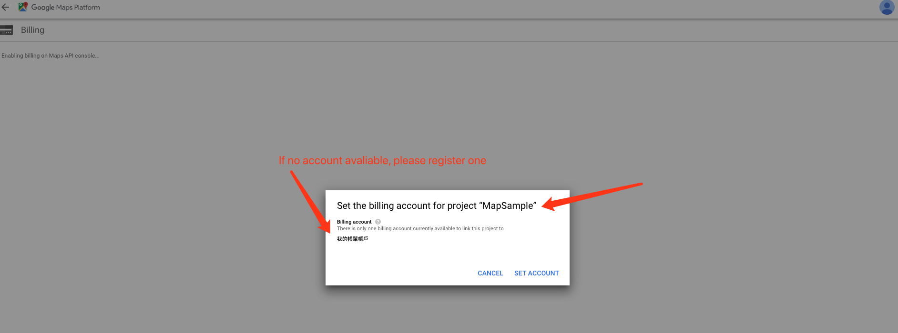

# Navigation

This project was generated with [Angular CLI](https://github.com/angular/angular-cli) version 8.3.4.

## Prerequisite

Please install [Node.js](https://nodejs.org/en/) [Angular CLI](https://github.com/angular/angular-cli) first.

Then install all dependency by running command `yarn` (preferred) or `npm i`.

## Configuration

This project requires Google Map API Key and a mock API server to work.
As required, however, they are not provided by default.
So please follow the instructions below to config.

* Set up API path
    
    Open file `enviroment.ts`, there is a value named `api_path`. 
    Replace `{{API_PATH}}` with the new API path. 

* Set up Google Map API Key

    Please go to [Google Maps Platform](https://developers-dot-devsite-v2-prod.appspot.com/maps/gmp-get-started)
    
    1. Click the `Quick Start` button, you may asked to login your Google account.
       
	2. Click `GET STARTED`, then select `Maps` and `Places`, then click `NEXT`.
       
	3. Click `Create a new project`
	   
	4. Input your new project name, then click `NEXT`
	   
	5. The new project must be assigned a billing account. Please follow the [guide](https://cloud.google.com/billing/docs/how-to/manage-billing-account) here to setup one.
	   
	6. Click `NEXT` and wait the project to load
	   
	   
	7. Once complete, the API key is shown in the alert. Please copy the value.
	   
    8. Open `index.html` under `src` folder. Replace the `{{API_KEY}}` with the api key value you just copied.

## Development server

Run `ng serve` for a dev server. Navigate to `http://localhost:4200/`. The app will automatically reload if you change any of the source files.

## Build

Run `ng build` to build the project. The build artifacts will be stored in the `dist/` directory. Use the `--prod` flag for a production build.

## Running unit tests

Run `ng test` to execute the unit tests via [Karma](https://karma-runner.github.io).

## Running end-to-end tests

Run `ng e2e` to execute the end-to-end tests via [Protractor](http://www.protractortest.org/).
